<div align="center">

# 📘 SAT Train

### Локальный тренажёр Digital SAT в интерфейсе Bluebook

Собирает настоящие модули из твоих PDF-подборок: пропорции доменов, таймер,
справочный лист формул и Desmos — всё на твоей машине, без аккаунтов и облака.

[](https://react.dev)
[](https://www.typescriptlang.org/)
[](https://vite.dev)
[](https://pymupdf.readthedocs.io/)


<br>

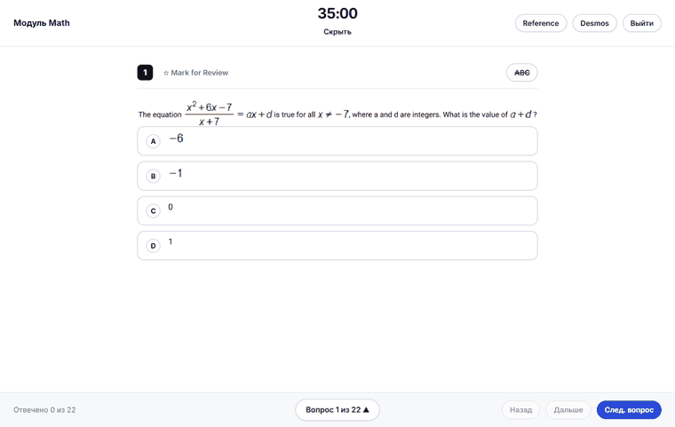

<sub>Инструменты открываются сбоку как вторая страница книги — вопрос сжимается, а не прячется под панелью</sub>

</div>

---

## Содержание

[Зачем это](#зачем-это) ·
[Как устроено](#как-устроено) ·
[Возможности](#возможности) ·
[На телефоне](#на-телефоне) ·
[Горячие клавиши](#горячие-клавиши) ·
[Быстрый старт](#быстрый-старт) ·
[Новые домены](#как-добавить-новый-домен) ·
[Структура](#структура-проекта) ·
[Данные](#данные-и-приватность) ·
[Планы](#дальше-в-планах)

## Зачем это

Онлайн-тренажёры дают вопросы вперемешку и по одному. Реальный экзамен — это **модуль**:
фиксированная длина, жёсткий таймер и строгие пропорции доменов. Разница в ощущениях
большая, и готовиться стоит именно к модулю.

SAT Train берёт PDF-подборки с вопросами, разбирает их в базу и собирает из неё модули
по правилам Bluebook — вместе с его инструментами и привычками интерфейса.

| | Сайты-тренажёры | SAT Train |
|---|---|---|
| Формат | вопрос за вопросом | целый модуль с таймером |
| Пропорции доменов | случайные | как на реальном экзамене |
| Инструменты | обычно нет | Reference + Desmos сбоку |
| Разбор ошибок | иногда | оригинальное объяснение из PDF |
| Данные | на их сервере | только у тебя в браузере |
| Интернет | обязателен | не нужен: вся база кешируется |
| Телефон | сайт | ставится на домашний экран |

## Как устроено

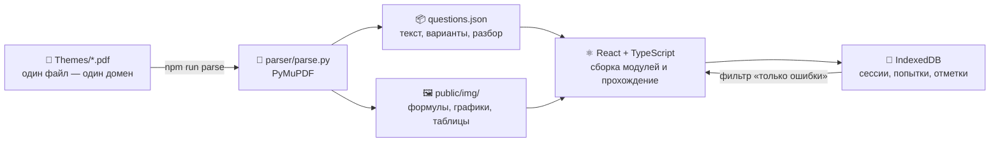

Источник правды — поля **внутри** PDF: домен, скилл, сложность, ID вопроса. Имя файла
только сверяется с ними. Поэтому повторный разбор **добавляет** новые вопросы и не ломает
ни базу, ни историю попыток.

## Возможности

### 🎯 Готовые режимы


| Режим | Что собирает |
|---|---|
| **Модуль R&W** | 27 вопросов · 32 мин · Craft 28% / Information 26% / SEC 26% / Expression 20% |
| **Модуль Math** | 22 вопроса · 35 мин · Algebra 35% / Advanced 35% / PSDA 15% / Geometry 15% |
| **Выносливость** | два модуля R&W подряд без пересечений, перерыв 10 мин, результаты только в конце |
| **Фокус** | набор по фильтрам слева: домен, скилл, сложность, статус |

Пресеты держат пропорции сами: галочки доменов на них не влияют, уже решённые вопросы
пропускаются, а домен, который база закрыть не может, показывается как **нехватка** —
а не подменяется молча другим.

### ⏱ Ход модуля

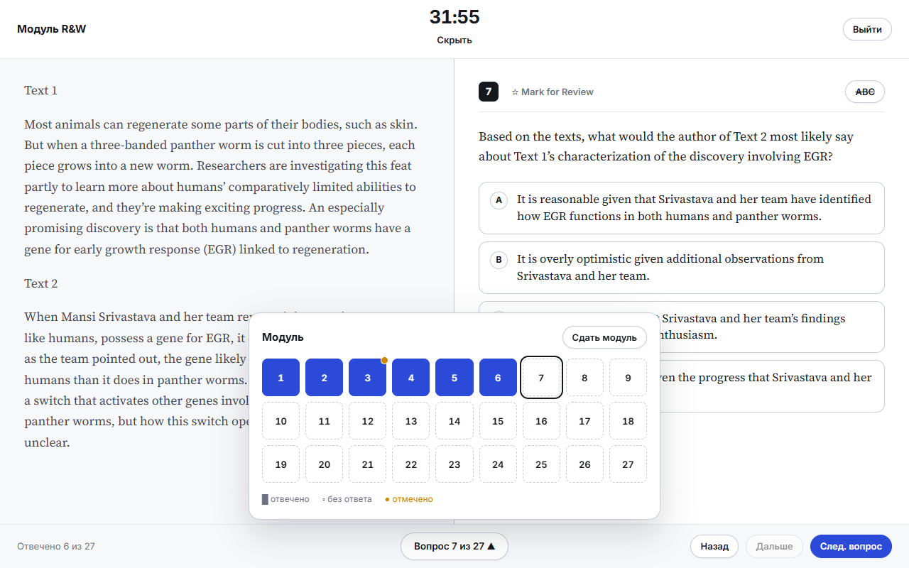

- Таймер со скрытием — чтобы не дёргал, но был под рукой
- **Mark for Review** и панель навигации: видно, что отвечено, что отмечено, где ты сейчас
- Зачёркивание вариантов (`ABC`) — как в Bluebook
- Перед досрочной сдачей показывает, что осталось без ответа и что отмечено

### 💡 Мгновенная проверка и разбор

<div align="center">
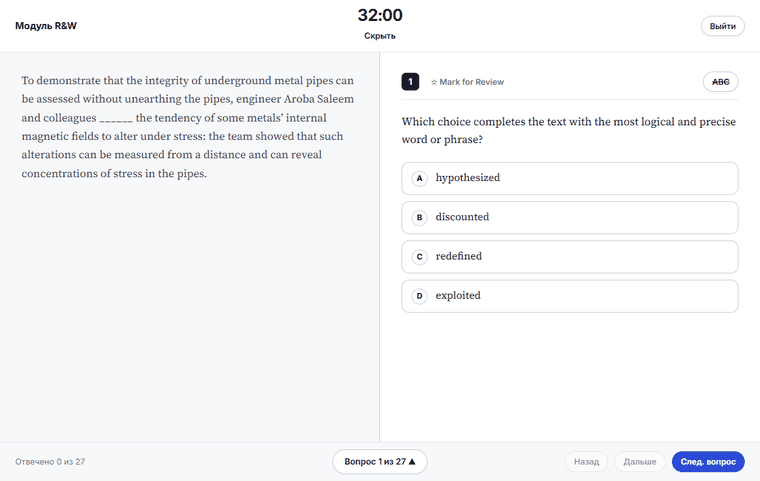
</div>

Ответил → **«Дальше»** → вариант окрашивается, и сразу открывается **разбор из оригинального
PDF**: почему верный ответ верный и почему каждый из остальных — нет.

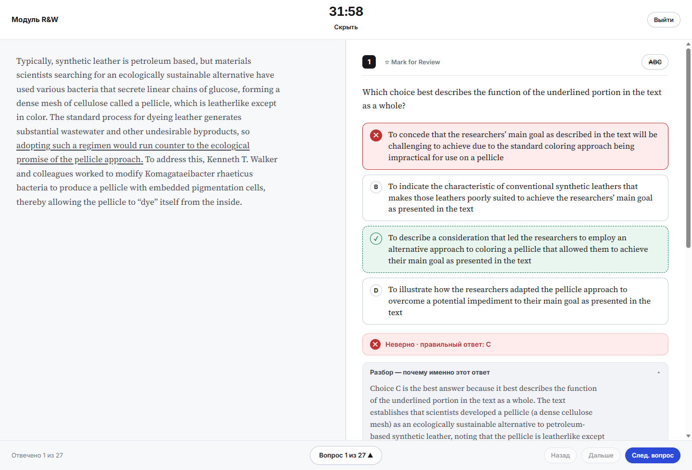

В Math разбор наполовину состоит из формул, поэтому там показывается вырезка прямо из PDF —
при переносе в текст они бы потерялись.

### 🧮 Инструменты Math — как в Bluebook


**Reference** — справочный лист формул, нарисованный вектором, а не картинкой: остаётся
чётким на любом зуме и перестраивается с 4 колонок до 1 по ширине панели.

**Desmos** — тот же графический калькулятор, что на реальном экзамене.

Оба открываются сбоку и забирают четверть экрана: вопрос плавно сжимается, а не прячется
под панелью. Ширину можно тянуть за край, на узком экране панель ложится поверх.

<br clear="right">

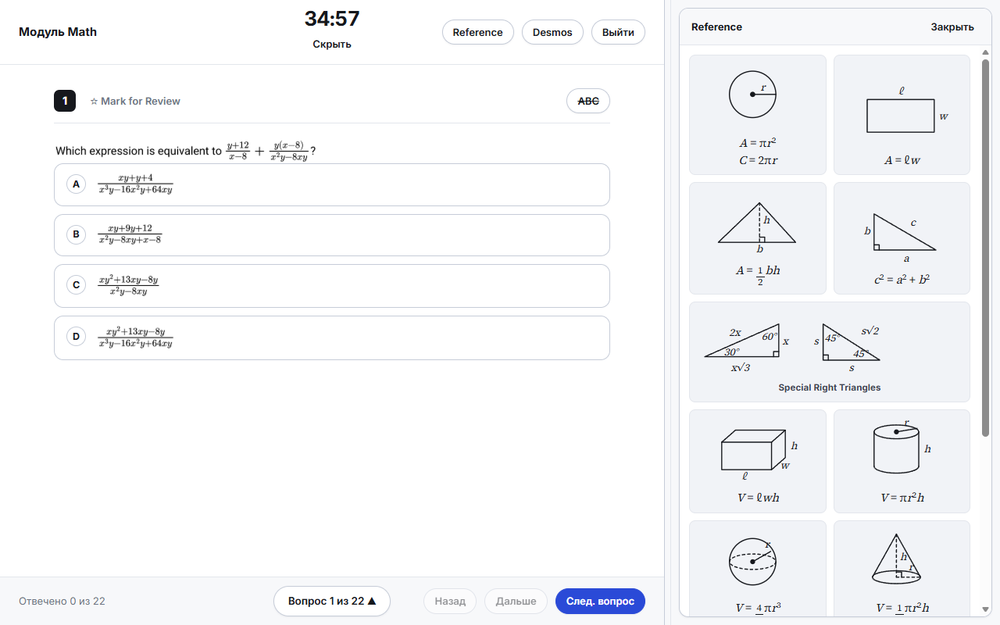

### 📊 Результат модуля

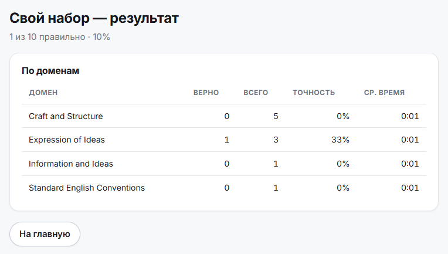

Точность и среднее время по каждому домену — сразу видно, куда уходит время и где
сыпется точность. Балл 200–800 намеренно не считается: на подборке только из Hard он
всё равно врёт.

## На телефоне

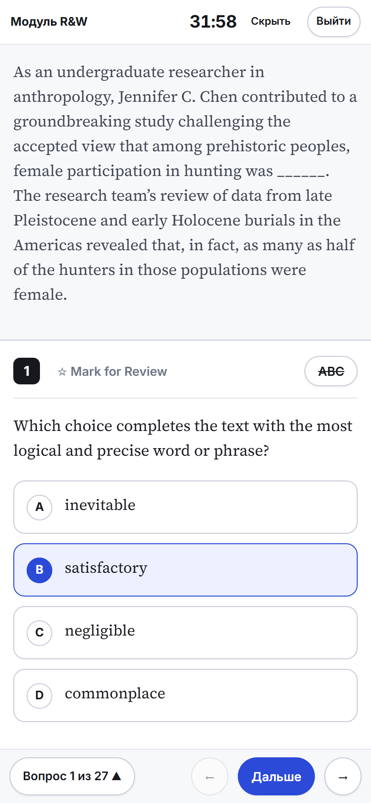

Экран теста собран под 390px отдельно: вместо двух панелей — одна лента, текст
и вопрос идут друг за другом, шапка и футер ужимаются в одну строку, а вырез и
домашняя полоска получают свои отступы. Высота считается в `dvh`, поэтому
съезжающая адресная строка не прячет кнопки.

- Шапка в одну строку: модуль, таймер, **Ref** и **Desmos**, выход
- Листалка внизу — та же, но кнопки размером под палец
- Зачёркивание вариантов и **Mark for Review** работают как на большом экране
- Hover-подсветка отключена: на тач-экране она залипала после тапа и
  перекрывала выбранный вариант

<br clear="right">

<table>
<tr>
<td width="50%" valign="top">

**Инструменты — на весь экран**

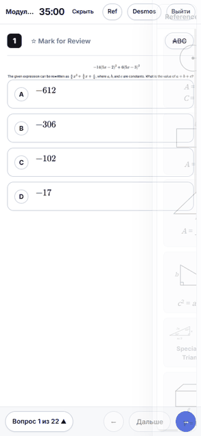

Четверть экрана делить не на чем, поэтому Reference и Desmos выезжают
целиком. Справочный лист сам складывается в две колонки.

</td>
<td width="50%" valign="top">

**Вырезки из PDF — по тапу**

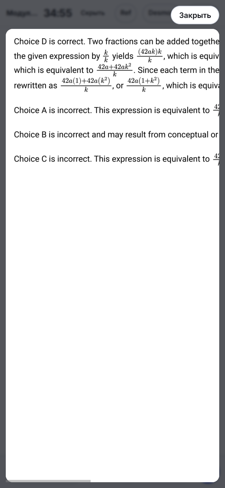

Ужатая в телефонную колонку формула теряет половину размера, поэтому любая
вырезка — график, таблица, разбор — открывается во весь экран с прокруткой.

</td>
</tr>
</table>

### Офлайн

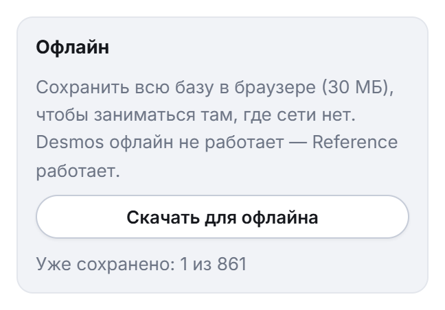

На главном экране есть блок **«Офлайн»**: он складывает всю базу — вопросы,
картинки, разборы — в кеш браузера (~30 МБ). После этого модуль запускается
вообще без сети: в метро, в тоннеле, в самолёте.

Заодно приложение ставится на домашний экран: Chrome предложит сам, в Safari —
«Поделиться» → «На экран „Домой"». Запускается без адресной строки, как обычное
приложение.

<br clear="right">

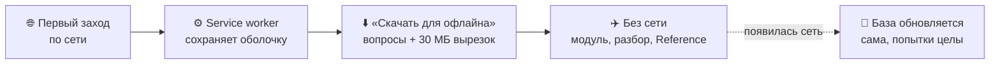

| | Офлайн |
|---|---|
| Вопросы, варианты, разборы | работают |
| Вырезки из PDF: графики, таблицы, формулы | работают |
| Reference — он нарисован вектором в приложении | работает |
| История попыток в IndexedDB | работает |
| **Desmos** — тянет свои скрипты на лету | **нет** |

## Горячие клавиши

| Клавиша | Действие |
|:--:|---|
| <kbd>A</kbd> <kbd>B</kbd> <kbd>C</kbd> <kbd>D</kbd> | выбрать вариант (в режиме зачёркивания — зачеркнуть) |
| <kbd>←</kbd> <kbd>→</kbd> | предыдущий / следующий вопрос |
| <kbd>M</kbd> | отметить вопрос |
| <kbd>Enter</kbd> | проверить ответ, затем перейти дальше |
| <kbd>Esc</kbd> | закрыть справочный лист |

## Быстрый старт

```bash
# 1. зависимости
npm install
pip install -r parser/requirements.txt

# 2. положи PDF-подборки в Themes/ и разбери их
npm run parse

# 3. запусти
npm run dev        # http://localhost:5173
```

Открыть с телефона в домашней сети — `npm run dev:lan`, затем набрать на
телефоне адрес, который Vite напечатает в строке **Network**.

Для калькулятора нужен ключ Desmos — положи его в `.env`:

```ini
VITE_DESMOS_API_KEY=твой_ключ
```

<details>
<summary><b>Остальные команды</b></summary>

```bash
npm run build      # сборка в dist/
npm run preview    # посмотреть собранное (здесь же работает офлайн-режим)
npm run dev:lan    # отдать дев-сервер в локальную сеть, для телефона
npm test           # проверки сборщика модулей: пропорции, нехватки, отсутствие повторов
npm run deploy     # собрать и залить на Cloudflare Pages
```

`npm run deploy` заливает **только собранный `dist/`** — на закрытый
Access-ом адрес, доступный по одной почте. Сам репозиторий остаётся без
материалов College Board.

</details>

## Как добавить новый домен

Положи ещё один PDF в `Themes/` и снова запусти `npm run parse`. Править код не нужно.

```
Themes/
├── Advanced Math.pdf
├── Craft and Structure.pdf
├── Expression of Ideas.pdf
├── Information and Ideas.pdf
└── SEC.pdf            → Standard English Conventions
```

<details>
<summary><b>Что делает парсер</b></summary>

- режет PDF на вопросы по ID и собирает поля: секция, домен, скилл, сложность, тип (MCQ / SPR);
- сохраняет текст с разметкой — подчёркивания и вставки доходят до экрана такими же, как в PDF;
- вырезает картинкой то, что текстом не переносится: формулы, графики, таблицы, варианты-формулы
  и разбор целиком;
- ставит каждому вопросу `parseConfidence`, чтобы кривые разборы было видно;
- сверяет имя файла с полем домена внутри PDF;
- при повторном запуске добавляет только новое — история попыток не трогается.

</details>

## Структура проекта

```
parser/parse.py        разбор PDF → questions.json + вырезки картинок
src/lib/modes.ts       сборка модулей: веса доменов, нехватки, порядок вопросов
src/lib/filters.ts     фильтры и выборка по весам
src/lib/db.ts          IndexedDB: сессии, попытки, отметки
src/screens/           Home · Test · Break · Results
src/components/        Reference · DesmosPanel · RichText · Crop
```

## Данные и приватность

В репозитории — только код. Сами PDF, разобранный `questions.json` и вырезки картинок
остаются на машине: это материалы College Board, и их место не на GitHub.

История попыток живёт в IndexedDB твоего браузера и никуда не уходит: ни аккаунтов, ни
синхронизации, ни аналитики. Единственный сетевой запрос за время работы — загрузка
скрипта Desmos.

Чтобы заниматься с телефона, собранная версия выкладывается на Cloudflare Pages —
туда вместе с кодом попадают и вырезки из PDF. Адрес закрыт **Cloudflare Access**:
войти можно только с одной разрешённой почты, в заголовках стоит `noindex`, а
`robots.txt` запрещает обход. Если такой размен не нужен, `npm run dev:lan`
отдаёт тренажёр в домашнюю сеть и наружу не выходит ничего.

## Дальше в планах

- [x] Парсер PDF, который принимает новые домены без правок кода
- [x] Готовые модули с пропорциями Bluebook и честной нехваткой
- [x] Reference и Desmos в боковой панели
- [x] Мгновенная проверка и разбор из PDF
- [ ] Разбор после модуля: вопрос, твой ответ, верный, объяснение, время
- [ ] Теги причин ошибки в один клик и очередь повторов по ним
- [x] Телефон: вёрстка под 390px и офлайн-режим
- [ ] Статистика: точность по доменам и скиллам, модуль 1 против модуля 2, динамика по датам

---

<div align="center">
<sub>Личный проект для подготовки. SAT и Bluebook — товарные знаки College Board, которая не имеет отношения к этому репозиторию.</sub>
</div>
