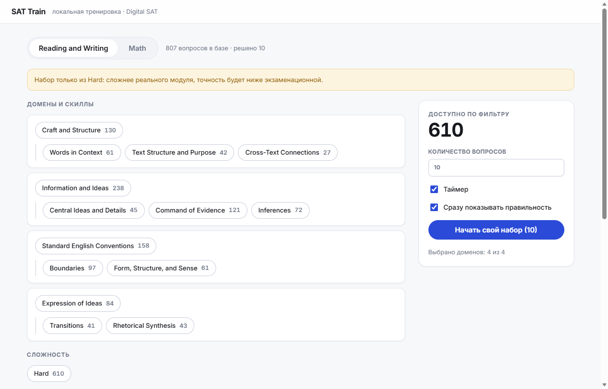
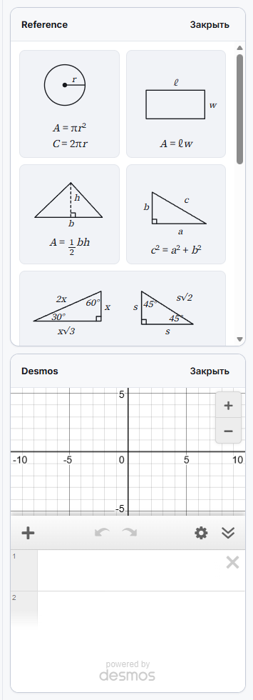

<div align="center">

# SAT Train

**Локальный тренажёр Digital SAT в интерфейсе Bluebook — без облака, без аккаунтов, без интернета.**

[](https://react.dev)
[](https://www.typescriptlang.org/)
[](https://vite.dev)
[](https://pymupdf.readthedocs.io/)




</div>

---

## Что это

Парсер забирает вопросы из PDF-подборок, а веб-приложение собирает из них модули с таймером,
пропорциями доменов и инструментами как в настоящем Bluebook. Всё работает на твоей машине:
вопросы лежат в `questions.json`, история попыток — в IndexedDB браузера. Ни одного сетевого
запроса, кроме загрузки самого Desmos.

## Возможности

### Готовые режимы

| Режим | Что собирает |
|---|---|
| **Модуль R&W** | 27 вопросов · 32 мин · Craft 28% / Information 26% / SEC 26% / Expression 20% |
| **Модуль Math** | 22 вопроса · 35 мин · Algebra 35% / Advanced 35% / PSDA 15% / Geometry 15% |
| **Выносливость** | два модуля R&W подряд без пересечений, перерыв 10 мин, результаты только в конце |
| **Фокус** | набор по фильтрам слева: домен, скилл, сложность, статус |

Пресеты держат пропорции сами: галочки доменов на них не влияют, уже решённые вопросы
пропускаются, а домен, который база не может закрыть, честно показывается как нехватка —
а не подменяется молча другим.

### Прохождение

- Таймер со скрытием, Mark for Review, зачёркивание вариантов, панель навигации по вопросам
- Предупреждение перед досрочной сдачей: что без ответа, что отмечено
- Мгновенная проверка ответа по кнопке — или классический режим «ответы в конце»
- Разметка текста: подчёркивания и вставки из PDF сохраняются как в оригинале

### Инструменты Math — как в Bluebook



- **Reference** — справочный лист формул, нарисованный вектором: остаётся чётким на любом
  зуме и перестраивается с 4 колонок до 1 по ширине панели
- **Desmos** — тот же графический калькулятор, что на реальном экзамене
- Оба открываются сбоку, забирая четверть экрана: вопрос плавно сжимается, а не
  закрывается панелью. Ширину можно тянуть за край, на узком экране панель ложится поверх

<br clear="right">

### Горячие клавиши

| Клавиша | Действие |
|---|---|
| `A` `B` `C` `D` | выбрать вариант (в режиме зачёркивания — зачеркнуть) |
| `←` `→` | предыдущий / следующий вопрос |
| `M` | отметить вопрос |
| `Enter` | проверить ответ, затем перейти дальше |
| `Esc` | закрыть справочный лист |

## Быстрый старт

```bash
# 1. зависимости
npm install
pip install -r parser/requirements.txt

# 2. положи PDF-подборки в Themes/ и разбери их
npm run parse

# 3. запусти
npm run dev
```

Открой `http://localhost:5173`.

### Как добавить новый домен

Положи ещё один PDF в `Themes/` и снова запусти `npm run parse` — править код не нужно.
Имя файла задаёт домен (`SEC.pdf` → *Standard English Conventions*), но источник правды —
поля внутри самого PDF; имя файла только сверяется с ними. Повторный разбор **добавляет**
вопросы и не трогает историю попыток.

Для калькулятора нужен ключ Desmos в `.env`:

```
VITE_DESMOS_API_KEY=твой_ключ
```

## Структура

```
parser/parse.py      разбор PDF → public/questions.json + вырезки картинок
src/lib/modes.ts     сборка модулей: веса доменов, нехватки, порядок вопросов
src/lib/filters.ts   фильтры и выборка по весам
src/lib/db.ts        IndexedDB: сессии, попытки, отметки
src/screens/         Home · Test · Results
src/components/      Reference · DesmosPanel · RichText · Crop
```

## Данные

В репозитории лежит только код. Сами PDF, разобранный `questions.json` и вырезки картинок
остаются на машине: это материалы College Board, и их место не на GitHub. История попыток
не покидает браузер — ни аккаунтов, ни синхронизации, ни аналитики.

## Дальше в планах

- [ ] Разбор ошибок после модуля: вопрос, твой ответ, верный, объяснение, время
- [ ] Теги причин ошибки в один клик и очередь повторов по ним
- [ ] Статистика: точность по доменам и скиллам, модуль 1 против модуля 2, динамика по датам

---

<div align="center">
<sub>Личный проект для подготовки. SAT и Bluebook — товарные знаки College Board, которая не имеет отношения к этому репозиторию.</sub>
</div>
